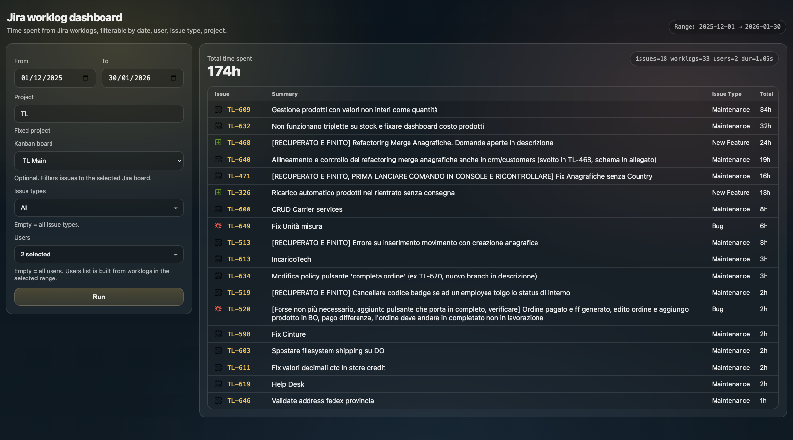

# Jira Worklog Dashboard

Minimal, Docker-friendly web dashboard that reads Jira Cloud worklogs and shows a filterable time summary table.



This project is intentionally opinionated:
- no database
- no charts
- a single “what did we log?” table you can run anywhere

## What You Get

- Web UI (no frontend build step)
- Filters: date range (max 90 days), Kanban board, issue types, users
- Results: table grouped by issue with total time spent
- Works well in LAN / homelab setups (single container)

## Requirements

- Jira Cloud
- Docker (recommended) or Go (for local dev)

## Quick Start (Docker Compose)

Prereqs:
- Docker Desktop / Docker Engine with `docker compose`
- Jira Cloud account with an API token

1) Clone

```bash
git clone https://github.com/gghidoni/jira-worklog-dashboard.git
cd jira-worklog-dashboard
```

2) Configure env

```bash
cp .env.example .env
```

Edit `.env` and set at least:
- `JIRA_BASE_URL` (e.g. `https://your-domain.atlassian.net`)
- `JIRA_EMAIL`
- `JIRA_API_TOKEN`

Recommended:
- `FIXED_PROJECT_KEY` (your project key) to enable board list and keep queries fast

3) Run

```bash
docker compose up --build
```

Open:
- `http://localhost:8080`

Healthcheck:
- `http://localhost:8080/healthz`

## Quick Start (Docker Run)

```bash
docker build -t jira-worklog-dashboard .
docker run --rm -p 8080:8080 --env-file .env jira-worklog-dashboard
```

## Quick Start (Prebuilt Image)

If you’re using a published image from GitHub Container Registry:

```bash
docker run --rm -p 8080:8080 --env-file .env ghcr.io/gghidoni/jira-worklog-dashboard:latest
```

## Jira Setup (API Token)

1) Create an API token in Atlassian:
   - https://id.atlassian.com/manage-profile/security/api-tokens
2) Use your Jira account email + the token as credentials.

Notes:
- The service uses basic auth (email + API token) against Jira Cloud REST APIs.
- Never commit `.env` (this repo ships `.gitignore` for it).

## How It Works

- Runs a Jira JQL search scoped by your filters.
- Fetches worklogs for matching issues.
- Aggregates time spent per issue and renders a server-side HTML page.
- Icons for issue types are proxied through this service (so the browser doesn’t need Jira auth).

## Using the Dashboard

- Date range defaults to last 7 days.
- Users list is built from worklogs found in the current selection (range + other filters).
- “Kanban board” filter is optional; if set, issues are taken from that board.

## Configuration

All configuration is via environment variables:

- `JIRA_BASE_URL` (required) e.g. `https://your-domain.atlassian.net`
- `JIRA_EMAIL` (required)
- `JIRA_API_TOKEN` (required)

- `LISTEN_ADDR` (default `:8080`)
- `DASH_TZ` (default `Europe/Rome`) timezone used for date boundaries
- `MAX_RANGE_DAYS` (default `90`) hard limit for date range
- `WORKLOG_CONCURRENCY` (default `8`) concurrent worklog fetches
- `FIXED_PROJECT_KEY` (default empty) force a single project key (recommended)

- `DASH_BASIC_AUTH_USER` / `DASH_BASIC_AUTH_PASS` (optional) add Basic Auth for the UI

## Board Filter (Kanban)

The board filter uses Jira Software Agile API endpoints (`/rest/agile/1.0/...`).

If the board dropdown is empty:
- your Jira plan/user may not have Jira Software access
- or the API token user cannot see boards

The dashboard still works without selecting a board.

## Troubleshooting

- `401 Unauthorized` or `403 Forbidden` from Jira:
  - verify `JIRA_BASE_URL`, `JIRA_EMAIL`, `JIRA_API_TOKEN`
  - verify the Jira user can browse the project and issues

- Some users show as accountId instead of names:
  - Jira can hide user profile details depending on permissions/privacy
  - the service attempts to resolve missing names via `/rest/api/3/user`, but Jira may deny it

- Slow / many issues:
  - reduce the date range
  - lower `WORKLOG_CONCURRENCY` if you hit rate limits

## Data & Privacy

- The service does not store worklogs on disk.
- Credentials are only read from environment variables.
- Do not expose the service publicly unless you understand the risk and add auth.

## Development

```bash
go test ./...
JIRA_BASE_URL=... JIRA_EMAIL=... JIRA_API_TOKEN=... go run ./cmd/jira-worklog-dashboard
```

## Releasing

This repo publishes a Docker image to GitHub Container Registry (GHCR) when you push a git tag that starts with `v`.

1) (Optional) update `CHANGELOG.md`
2) Tag and push:

```bash
git tag v0.1.0
git push origin v0.1.0
```

3) Wait for GitHub Actions to finish (workflow: `Publish Docker image`)

Images:
- `ghcr.io/gghidoni/jira-worklog-dashboard:v0.1.0`
- `ghcr.io/gghidoni/jira-worklog-dashboard:latest`

## Contributing

See `CONTRIBUTING.md`.

## Security

See `SECURITY.md`.

## License

MIT (see `LICENSE`).
